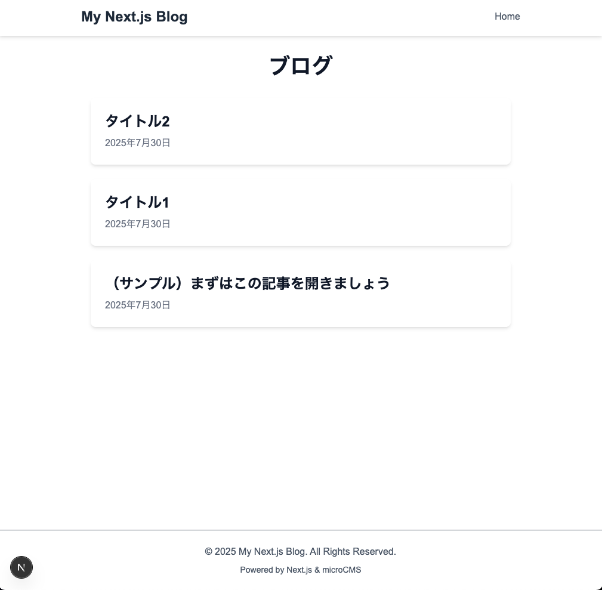

# Next.js & microCMS Blog



## 概要

このプロジェクトは、Next.js (App Router), TypeScript, Tailwind CSS を使用して作成した、ヘッドレスCMS (microCMS) と連携するブログアプリケーションです。
Next.jsの学習アウトプットとして、モダンなWeb開発の基本的な要素を盛り込んでいます。

## 主な機能

-   **ブログ記事表示:** microCMSから取得した記事の一覧および詳細ページを表示
-   **SSG (静的サイト生成):** ビルド時にCMSからデータを取得し、高速な静的ページを生成
-   **コメント機能:** giscus (GitHub Discussions連携) を利用したコメントシステムの導入
-   **レスポンシブデザイン:** Tailwind CSSによる、PC・スマートフォン両対応のデザイン

## 使用技術 (技術スタック)

-   **フレームワーク:** Next.js 14+ (App Router)
-   **言語:** TypeScript
-   **スタイリング:** Tailwind CSS, @tailwindcss/typography
-   **CMS:** microCMS
-   **コメントシステム:** giscus (@giscus/react)
-   **パッケージ管理:** npm / pnpm

## 環境構築

1.  リポジトリをクローンします。
    ```bash
    git clone https://github.com/rrencanno/nextjs-blog-ts.git
    ```

2.  プロジェクトディレクトリに移動し、依存パッケージをインストールします。
    ```bash
    cd nextjs-blog-ts
    npm install
    ```

3.  `.env.local` ファイルを作成します。
    プロジェクトのルートに `.env.local` ファイルを作成し、以下の内容を記述してください。
    `MICROCMS_SERVICE_DOMAIN` と `MICROCMS_API_KEY` は、ご自身のmicroCMS管理画面から取得してください。

    ```dotenv
    # .env.local
    MICROCMS_SERVICE_DOMAIN="YOUR_SERVICE_DOMAIN"
    MICROCMS_API_KEY="YOUR_API_KEY"
    ```

4.  開発サーバーを起動します。
    ```bash
    npm run dev
    ```

5.  ブラウザで [http://localhost:3000](http://localhost:3000) を開きます。

## 工夫した点・学んだこと

-   **ヘッドレスCMS連携:** ローカルのファイルではなく、外部のヘッドレスCMS (microCMS) からAPI経由でデータを取得することで、コンテンツ管理とフロントエンドを分離した開発を経験しました。
-   **TypeScriptの活用:** `props` やAPIレスポンスのデータに型を定義することで、開発中のエラーを減らし、コードの安全性を高めることの重要性を学びました。
-   **外部サービス連携:** giscusを導入することで、バックエンドを自前で構築することなく、インタラクティブな機能を迅速に追加できることを学びました。
